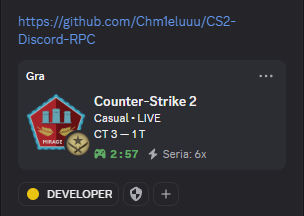
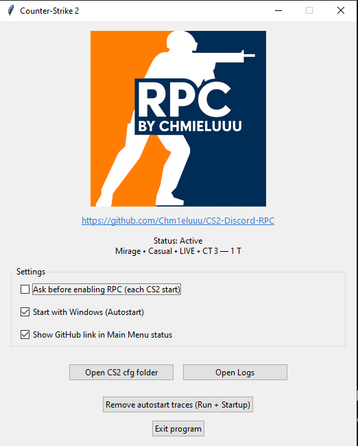

# CS2 Discord RPC

A small and safe Discord Rich Presence app for **Counter-Strike 2**, created by [Chmieluuu](https://github.com/Chm1eluuu).  
It shows your current map, mode, side (CT/T), and live score directly on your Discord profile — automatically and in real time.

🔗 GitHub: [https://github.com/Chm1eluuu/CS2-Discord-RPC](https://github.com/Chm1eluuu/CS2-Discord-RPC)

---

## Features

- **Live Discord status** – updates automatically while you play CS2  
- **Map and team icons** – large map image and small CT/T logo  
- **Auto config creation** – generates `gamestate_integration_cs2_rpc.cfg` automatically  
- **System tray** – runs in the background, with Console and Quit options  
- **Autostart support** – can launch automatically with CS2 (can be disabled)  
- **VAC/Steam safe** – uses official Game State Integration, no memory reading or injection  

---

## How to Use

1. Download the latest version from [Releases](https://github.com/Chm1eluuu/CS2-Discord-RPC/releases)  
2. Unzip the file (if zipped)  
3. Run `CS2DiscordRPC.exe`  
   - The program will minimize to the system tray  
   - Right-click the tray icon to open the console or quit  
4. Open **Discord**  
5. Start **Counter-Strike 2**  
6. Your Discord will automatically show:
   - Current map  
   - Team side (CT/T)  
   - Game mode (Competitive, Wingman, etc.)  
   - Live score  

That’s all — just launch CS2 and the RPC updates automatically.

---

## Examples

| In Game | On Discord | Program |
|----------|-------------|-------------|
|  |  | |  

---

## Safety

The app doesn’t touch game memory or edit any CS2 files.  
It only uses Valve’s official **Game State Integration** system.  
Safe for **Steam** and **VAC**.

---

## Author

Made by **[Chmieluuu](https://github.com/Chm1eluuu)**  
Just clean and simple Discord integration for CS2.
